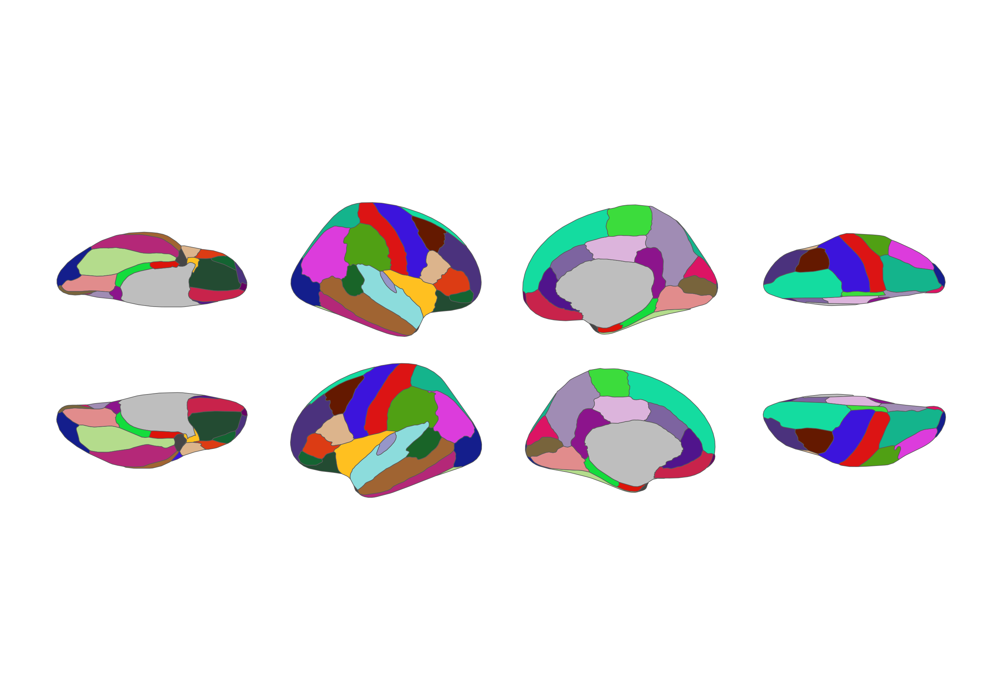

<!-- README.md is generated from README.qmd. Please edit that file -->

# ggsegDefaultExtra 

<!-- badges: start -->

[](https://zenodo.org/badge/latestdoi/250292657)
[](https://codecov.io/gh/LCBC-UiO/ggsegDefaultExtra?branch=master)
[](https://github.com/LCBC-UiO/ggsegDefaultExtra/actions)
<!-- badges: end -->

This package contains dataset for plotting the extra datasets based on
the default ggseg and ggseg3d atlases: Desikan-Killany cortical atlas
(`dk`) and the aseg subcrotical atlas.

`dkextra` contains both superior and inferior views of the inflated
brain for the dk-atlas `hcpa()` contains the aseg atlas, with additional
division of the hippocampus into anterior and posterior parts

## Installation

We recommend installing the ggseg-atlases through the ggseg
[r-universe](https://ggseg.r-universe.dev/ui#builds):

``` r
options(repos = c(
  ggseg = "https://ggseg.r-universe.dev",
  CRAN = "https://cloud.r-project.org"
))

install.packages("ggsegDefaultExtra")
```

You can install from [GitHub](https://github.com/) with:

``` r
# install.packages("remotes")
remotes::install_github("LCBC-UiO/ggsegDefaultExtra")
```

## Example

``` r
library(ggsegDefaultExtra)
library(ggseg)
library(ggplot2)

ggplot() +
  geom_brain(
    atlas = dkextra(),
    mapping = aes(fill = label),
    position = position_brain(hemi ~ view),
    show.legend = FALSE
  ) +
  scale_fill_manual(values = dkextra()$palette, na.value = "grey") +
  theme_void()
```



### hcpa (3D only - subcortical atlas)

``` r
library(ggseg3d)

ggseg3d(atlas = hcpa()) |>
  pan_camera("right lateral")
```


